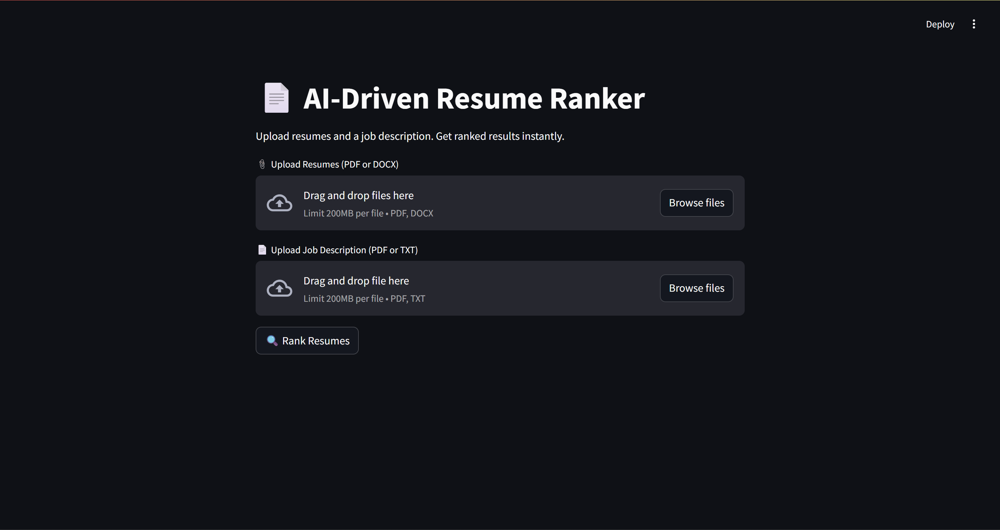
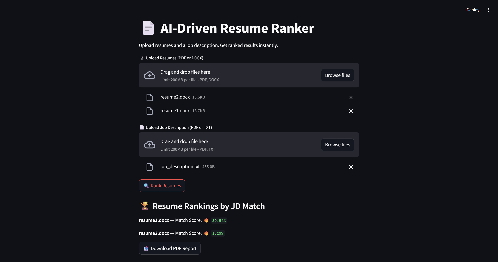
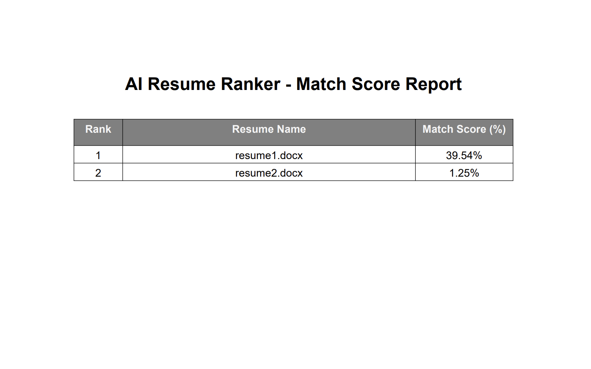

# 🤖 AI‑Driven Resume Ranker

An intelligent, job-ready resume ranking system built with Python and Streamlit.  
It reads multiple resumes and a job description, analyzes them using **TF-IDF + Cosine Similarity**, and ranks resumes by match score.

---

## 🚀 Features

- 📎 Upload multiple resumes (PDF/DOCX)
- 📄 Upload job description (PDF/TXT)
- 🔍 AI-based resume scoring using TF-IDF + cosine similarity
- 🧾 Match scores displayed instantly on-screen
- 📥 **Downloadable PDF report** (now in clean **table format**)
- ✅ Clean UI with resume previews
- 🧠 Built using NLP (spaCy + scikit-learn)

---

## 📸 Demo Screenshot






## 🛠️ Tech Stack

- Python
- Streamlit
- scikit-learn
- PyPDF2 / python-docx
- spaCy (NLP)
- ReportLab (PDF generation)

---

## 📁 Folder Structure

ai_resume_ranker/

├── app.py

├── resume_parser.py

├── utils.py

├── ranker.py

├── report_generator.py

├── resumes/

├── job_descriptions/

├── output/

└── README.md

---

## 📦 How to Run

```bash
# Step 1: Clone the repo
git clone https://github.com/YOUR_USERNAME/ai-resume-ranker.git

# Step 2: Go into the folder
cd ai-resume-ranker

# Step 3: Create and activate virtual env
python -m venv venv
venv\Scripts\activate

# Step 4: Install packages
pip install -r requirements.txt
python -m spacy download en_core_web_sm

# Step 5: Run the app
streamlit run app.py

🧠 Future Features
🔍 Highlight matched keywords

📊 CSV export

🎨 Improved UI with progress bars

🤖 Use ChatGPT/LLMs for smarter matching


---

### ✅ Step 2: Save the file

Click **File → Save**, or press `Ctrl + S`.

---

## 🔁 Step 3: Upload README to GitHub

Now run these in VS Code terminal (where you already pushed your code earlier):

```bash
git add README.md
git commit -m "📝 Added professional README file"
git push origin main
